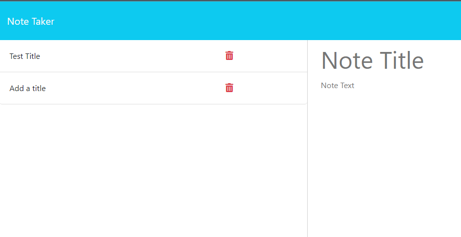

  <h1 align = "center"h1>note-taker</h1>

  
 As a small business owner I want to be able to write and save notes, so that I can organize my thoughts and keep track of tasks I need to         complete.

   
  
  

  
  
  
  

  
   
  
  ## Description
  
  
Through this app you can add and delete notes so you stay organized and keep track of the tasks you have to complete in your business.

  
   

  ## Table of Content

  - [Installation](#installation)
  - [Usage](#usage)
  - [Preview](#preview)
  - [License](#license)
  - [Contributing](#contributing)
  - [Test](#test)

   

  ## Installation
  
  To install this app clone the code into your preferred directory.  
  
   
  
  ## Usage
  Run the "npm start" command in yur terminal, and then run "http://localhost:3001/notes" in your browser. Or simply launch the app by following the link below. 
  Enter a note title that you chose, and below it enter the notes that you need to take down. 
  A save button will appear on the top right corner of the screen. Click it once you are finished taking the notes. This note will be saved in the left column,
  and you can access it any time you need to. 
  
   
  
  ## Link
  To lunch the app click here  👉  

  
   
  
  ## Preview
  
  
   
  
  ## License
  
  This application is covered under [MIT License](https://choosealicense.com/licenses/mit/)
  
   
  
  ## Contributing
  
  All users, feel free to contribute to this project.
  
   
  
  ## Questions and Issues
  
  👇 For any questions or issues, feel free to contact me through the contact info provided below 👇
  
  ### GitHub account
  
  [Genci Odobashi](https://github.com/odobashigenci)

  
  ### Email me
  
  
  
   
